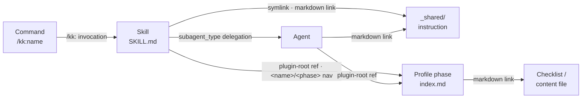

# Architecture

This document describes how claude-toolbox components fit together. For conventions on authoring skills, profiles, and agents, see [`CLAUDE.md`](https://github.com/serpro69/claude-toolbox/blob/master/CLAUDE.md).

## Overview

claude-toolbox provides a development environment for two AI coding providers (Claude Code and Codex) through three integrated components:

```
klaude-plugin/          (canonical source)
    |
    |-- generate-kodex --> kodex-plugin/      (generated Codex variant)
    |                      .codex/agents/     (generated sub-agents)
    |
.claude/                (Claude Code config)
.codex/                 (Codex config — hand-authored)
.github/                (template sync infrastructure)
```

## Components

### kk Plugin (`klaude-plugin/`)

The canonical source of truth for all workflow functionality. Contains:

- **`skills/`** — 10 workflow skills (/kk:design, /kk:implement, /kk:review-code, /kk:test, /kk:document, etc.)
- **`commands/`** — Slash commands for isolated/variant invocations
- **`agents/`** — Sub-agent definitions (code-reviewer, design-reviewer, spec-reviewer, eval-grader, profile-resolver)
- **`profiles/`** — Per-domain content (Go, Java, JS/TS, Kotlin, K8s, Python) with detection rules, review checklists, implementation gotchas, design prompts, test validators, and doc rubrics
- **`hooks/`** — Hook definitions (SessionStart plugin-root export, PreToolUse Bash validation)
- **`scripts/`** — Hook scripts (`set-plugin-root.sh`, `validate-bash.sh`)

Skills reference shared instructions via symlinks to `skills/_shared/`. Profiles are referenced via `${CLAUDE_PLUGIN_ROOT}/profiles/` paths (substituted at plugin-load time by the Claude Code harness).

### Codex Generation (`cmd/generate-kodex/`)

A Go tool that transforms `klaude-plugin/` into Codex-compatible artifacts:

- **`kodex-plugin/`** — Skills with `${CLAUDE_PLUGIN_ROOT}` resolved to relative paths, injected headers, and copied profiles
- **`.codex/agents/*.toml`** — Sub-agent markdown converted to TOML format with `developer_instructions`

Driven by `scripts/kodex-generate-manifest.yml`. Run via `make generate-kodex`.

### Plugin Graph Analysis (`cmd/plugin-graph/`)

A Go tool that builds a directed dependency graph of `klaude-plugin/` and reports complexity metrics, impact analysis, and structural health. It gives maintainers and review skills a measured view of the skill web rather than a felt one.

It discovers six edge types across the plugin's link taxonomy: markdown links, symlinks, `${CLAUDE_PLUGIN_ROOT}` template references, parameterized navigation paths (`<name>`/`<phase>`/`<checklist>` expanded over known sets), agent delegations (`subagent_type` table rows), and `/kk:` skill/command invocations. Edges use a **dual-layer model** — raw file endpoints drive broken-edge validation, while endpoints normalized to the owning artifact node drive metrics (fan-in/out, depth, transitive closure, coupling). Intra-artifact self-references are suppressed from the metric graph.

Subcommands: `graph` (emit the graph), `metrics` (complexity numbers), `validate` (broken-edge/orphan gate, exit 1 on findings). Output formats: `text`, `json`, `dot`, `mermaid`. Global `--root` selects the plugin directory; `--ref <git-ref>` analyzes a past commit via a throwaway `git worktree`. `graph`/`metrics` support targeted mode (positional args slice the graph to nodes reachable from a start set); `validate` rejects targets because its findings are whole-graph health signals.

Broken-edge detection exempts **non-operative sources** — links from `evals/` fixtures (deliberately partial) and `example-*.md` templates — mirroring the orphan-detection `evals/` exemption. Run via `make plugin-graph` (Go tests + `validate` against the real plugin); see [Testing](testing.md).

#### The model at a glance

The six edge types connect a handful of artifact types. Each arrow below is one edge type; the concrete graph expands these over every skill, command, agent, profile phase, and shared instruction.



For the complete, zoomable node-and-edge graph of the real plugin, see [Plugin Graph](plugin-graph.md).

#### Current metrics

Regenerated from the live plugin on every docs build (`make plugin-graph-docs`), so these numbers track the plugin as it stands:

--8<-- "contributing/_generated/plugin-graph-metrics.md"

### Claude Code Config (`.claude/`)

- **`settings.json`** — Permission baselines (allow/deny lists), env vars, model, plugin marketplace
- **`settings.local.json`** — Per-repo overrides (never synced)
- **`CLAUDE.extra.md`** — Behavioral instructions (synced downstream)
- **`scripts/`** — Statusline scripts (basic and enhanced themes)

### Codex Config (`.codex/`)

Hand-authored (not generated):

- **`config.toml`** — Model, approval policy, features, MCP server config (capy)
- **`hooks.json`** — SessionStart (injects context) and PreToolUse (Bash validation) hooks
- **`rules/default.rules`** — Starlark command policies (ported from Claude deny list)
- **`scripts/`** — Hook scripts (session-start.sh, pretooluse-bash.sh)

Generated (by `cmd/generate-kodex/`):

- **`agents/*.toml`** — Sub-agent definitions

### Documentation Site (`docs/`, `mkdocs.yml`)

MkDocs Material site with a custom Tokyo Night color scheme, deployed to GitHub Pages via [mike](https://github.com/jimporter/mike) for versioned documentation.

- **`mkdocs.yml`** — Site config: Tokyo Night theme (`tokyonight:dark`/`tokyonight:light`), tabs nav, pymdownx extensions, mike versioning
- **`docs/`** — Content pages (getting-started, user-guide, providers, contributing, about) alongside internal docs (adr, wip, done — excluded from search)
- **`docs/overrides/`** — Template overrides: `main.html` (base with Space Mono font, OG tags), `home.html` (custom landing page with scroll-pinned hero→pipeline transition and matrix rain effect)
- **`docs/assets/`** — `stylesheets/tokyonight.css` (color scheme), `stylesheets/extra.css` (site-wide tweaks), `javascripts/terminal.js` (placeholder for future non-homepage JS)
- **`requirements.txt`** — Python deps (mkdocs-material, mike, mkdocs-minify-plugin, mkdocs-panzoom-plugin)
- **`.github/workflows/docs.yml`** — CI: builds and deploys via mike on master push or version tags

### Template Infrastructure (`.github/`)

- **`template-cleanup.sh`** — Initializes a new repo from the template (interactive or CI)
- **`template-sync.sh` / `template-sync.yml`** — Pulls upstream config updates into downstream repos via PR
- **`template-state.json`** — Sync manifest tracking version, variables, and exclusions

## Installation Modes

Users interact with claude-toolbox through three distinct modes, each providing a different subset of functionality:

| What you get                 | Plugin-only | Template / Sync | Full repo checkout |
| ---------------------------- | :---------: | :-------------: | :----------------: |
| Skills (10 workflow skills)  |      Y      |        Y        |         Y          |
| Profiles (language-specific) |      Y      |        Y        |         Y          |
| Commands                     |  Y (Claude) |    Y (Claude)   |         Y          |
| Hooks                        |  Y (Claude) |        Y        |         Y          |
| Sub-agents                   |  Y (Claude) |        Y        |         Y          |
| Config (settings/rules)      |             |        Y        |         Y          |
| Statusline                   |             |        Y        |         Y          |
| Template sync infrastructure |             |        Y        |         Y          |
| Generation tools / tests     |             |                 |         Y          |

**Plugin-only (Claude):** `/plugin install kk@claude-toolbox` — skills, commands, hooks, agents, profiles.

**Plugin-only (Codex):** `codex plugin marketplace add serpro69/claude-toolbox` — skills and profiles only. Hooks, agents, rules, and config require template setup.

**Template / Sync:** Full configuration for both providers, kept in sync with upstream via GitHub Actions.

**Full repo checkout:** Everything above plus the generation tools (`cmd/`), test suites (`test/`), and maintainer workflows.

### Marketplace gotchas

**Plugin source paths must use `"./"`, not `"."`** In `marketplace.json`, the `source` field for each plugin entry must use `"./"` (with trailing slash) for repo-root plugins, not bare `"."`. Claude Code's path resolver does not treat them equivalently — `"."` causes `plugin install` to fail with a misleading "source type not supported" error. Paths to subdirectories (e.g., `"./klaude-plugin"`) already include the `"./"` prefix and are unaffected.

**Stale marketplace cache after fixing.** Claude Code caches cloned marketplace repos under `~/.claude/plugins/`. After fixing `marketplace.json` and pushing, `marketplace add` or `marketplace update` may still use the stale cache. For a clean slate: remove the marketplace entry from `~/.claude/plugins/marketplaces/<name>/`, delete any references in `~/.claude/plugins/known_marketplaces.json` and `~/.claude/plugins/installed_plugins.json`, then re-add with `claude plugin marketplace add`.

## Data Flow

### Skill execution

```
User invokes /kk:review-code
  → Claude Code loads SKILL.md (${CLAUDE_PLUGIN_ROOT} substituted)
  → Skill reads shared instructions via symlinks
  → Profile detection runs (git diff --stat → DETECTION.md matching)
  → Profile content loaded (index.md → always-load + conditional files)
  → Subject-matter action (read diff, produce findings)
```

### Template sync

```
Downstream repo triggers sync workflow
  → Sparse-clones upstream at specified version
  → Reads .github/template-state.json for variables and exclusions
  → Copies .claude/, .codex/ to staging
  → Applies variable substitutions (CC_MODEL, CODEX_MODEL, etc.)
  → Smart-merges settings.json (new keys added, existing preserved)
  → Creates PR with changes
```

### Documentation publishing

```
Push to master
  → .github/workflows/docs.yml triggers
  → mike deploy --push dev (unreleased docs)

Push tag v0.14.0
  → .github/workflows/docs.yml triggers
  → Extracts major.minor → "0.14"
  → mike deploy --push --update-aliases "0.14" latest
  → mike set-default --push latest (bare URL → latest release)
  → GitHub Pages serves from gh-pages branch
```

### Codex generation

```
make generate-kodex
  → go test (unit tests for generation tool)
  → go run cmd/generate-kodex -manifest scripts/kodex-generate-manifest.yml
    → Copy skills with ${CLAUDE_PLUGIN_ROOT} → relative path transform
    → Copy profiles as-is
    → Convert agents/*.md → agents/*.toml
    → Generate .codex-plugin/plugin.json
  → make test-structure (validate bidirectional invariants)
```

## ADRs

Architecture decisions are recorded in `docs/adr/`:

| ADR | Decision |
|-----|----------|
| [0001](../adr/0001-profile-detection-model.md) | Profile detection model (path → filename → content signals) |
| [0002](../adr/0002-profile-content-organization.md) | Profile content organization (per-phase subdirectories) |
| [0003](../adr/0003-plugin-root-referenced-content.md) | Plugin-root referenced content (no symlinks into profiles) |
| [0004](../adr/0004-skill-workflow-ordering.md) | Skill workflow ordering (instructions before action) |
| [0005](../adr/0005-codex-hook-enforcement-gap.md) | Codex hook enforcement gap (advisory + hook two-layer approach) |
