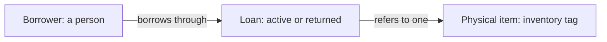

# Equipment-lending glossary

Equipment lending connects a borrower, a loan, and a physical inventory item. This kit supports the decision required before checkout validation: may one item have multiple active loans? The answer is **undecided**. The snapshot contains two active loans for one item; it supplies no runtime or enforcement evidence.

> **Freshness:** This page is `proposed` until reviewed by a human other than its author; it is not self-certified. Check staleness by re-running `/kk:review-architecture` against the Derived-from anchors at consumption time.

The diagram expresses the brief's concepts. Multiple loan records can refer to an item in the supplied snapshot; permitted concurrent active cardinality remains a business decision. Borrowers are represented by names here, not by a supplied person registry.

## Requirements and provenance

The operations owner's ask, quoted in `requirements.md`, is: "Before we add checkout validation, determine whether one physical item may have multiple active loans."

The brief also requires: "The domain kit should expose the decision to the operations owner before anyone changes checkout."

> **Provenance:** The definitions below follow `requirements.md`; stored-record observations derive from `records.json`. Reverse-engineered intent is a presumption, `proposed` until human ratification. No code or enforcement implementation was supplied. Neither the snapshot nor this kit approves a uniqueness rule.

## Business rules

| # | Rule or decision | Status | Enforcement evidence |
| --- | --- | --- | --- |
| L1 | An item is a physical piece of equipment identified by its inventory tag. | proposed | Declared in `requirements.md`; represented by `records.json` `items[].tag`. Runtime identity constraints unknown. |
| L2 | A loan records one person borrowing one item. | proposed | Declared in `requirements.md`; represented by `records.json` `loans[].borrower` and `loans[].item`. Runtime validation unknown. |
| L3 | A loan without `returned_at` is currently active. | proposed | Declared in `requirements.md`; both supplied loans have `returned_at: null`. Runtime lifecycle handling unknown. |
| L4 | Whether one item may have multiple active loans requires an operations-owner decision before checkout validation changes. | undecided | No approved uniqueness rule or implementation supplied; see [P1](equipment-lending-traps.md#p1--stored-multiplicity-does-not-settle-policy) and RQ-1. |

`proposed` preserves the supplied definitions without claiming separate human ratification of this kit.

## Terms

### Item

- **Definition:** One physical piece of equipment identified by an inventory tag.
- **Bindings:** `requirements.md`; `records.json` `items[].tag` and `loans[].item`.
- **Status:** proposed
- **Aliases:** physical item, equipment item.
- **Not to be confused with:** A loan, which records borrowing of the item.
- **Notes:** `CAM-7` identifies the camera in the snapshot. Permitted simultaneous active loans are undecided, not implied by its physical identity.

### Loan

- **Definition:** A record of one person borrowing one item.
- **Bindings:** `requirements.md`; `records.json` `loans[]`.
- **Status:** proposed
- **Not to be confused with:** The physical item itself or proof of who currently possesses it.
- **Notes:** Distinct records `L1` and `L2` both reference `CAM-7`. Their presence establishes stored multiplicity only.

### Borrower

- **Definition:** The person recorded as borrowing an item through a loan.
- **Bindings:** `requirements.md`; `records.json` `loans[].borrower`.
- **Status:** proposed
- **Not to be confused with:** An independently verified current custodian.
- **Notes:** Mira and Ola are the recorded borrower names. No person identity system is supplied.

### Active loan

- **Definition:** A loan without a recorded `returned_at`, following the brief's current definition.
- **Bindings:** `requirements.md`; `records.json` `loans[].returned_at`.
- **Status:** proposed
- **Not to be confused with:** Authorization for concurrent lending or evidence of actual possession.
- **Notes:** Both supplied loans have `returned_at: null`, so both are active under the brief. The records contain no checkout times from which to rank them or reconstruct their history.

## Decision queue

- **RQ-1 — Decider: operations owner.** May a single inventory-tagged physical item have more than one active loan at the same time: yes or no? **Unblocks:** L4 and the policy checkout validation must implement.
- **RQ-2 — Decider: operations owner, if RQ-1 is no.** For `CAM-7`, which loan, if either, should remain active after checking the actual lending situation? **Unblocks:** reconciliation of `L1` and `L2`; neither record can be selected as authoritative from this snapshot alone.

These questions remain open; no checkout or data changes are authorized by the kit. The next step is an operations-owner conversation, not further modelling of an assumed uniqueness policy.

---
**Derived-from:** `requirements.md`; `records.json` (`items[]`, `loans[]`).
