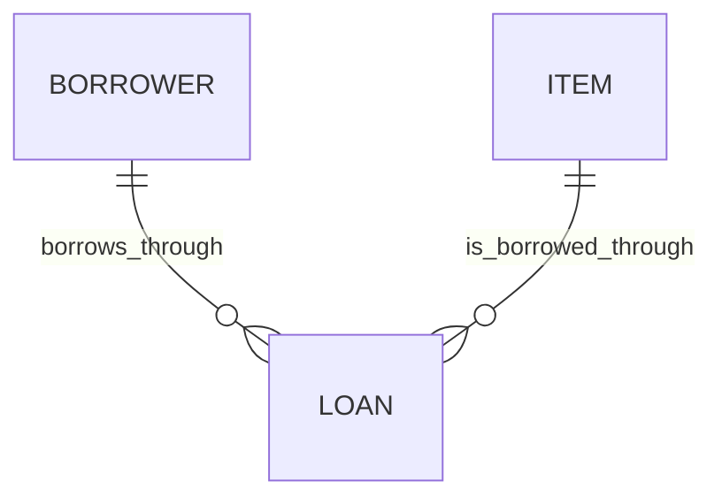

# Equipment lending

This context describes physical equipment and the people borrowing it. The forcing question is whether one physical item may have multiple active loans before checkout validation is added. The operations owner's answer is outstanding; the supplied records cannot decide it.

> **Freshness:** This page is `proposed` until reviewed by a human other than its author; it is not self-certified. Check staleness by re-running `/kk:review-architecture` against the Derived-from anchors at consumption time. Freshness is a verification run, not a standing promise.

Read this page with the [conventions](index.md) and [traps page](equipment-lending-traps.md).

The diagram describes associations across loan records, not permission for concurrent active loans. The active-loan limit for an item is unresolved.

## Business rules

> **Provenance:** Definitions and declared meanings below come from `requirements.md`; bindings and observations come from `records.json`. Any intent reverse-engineered from data or code is a presumption, `proposed` until a human with domain authority ratifies it. Stored records do not establish permission or enforcement. No runtime implementation was supplied.

| # | Rule or decision | Status | Source and enforcement evidence |
| --- | --- | --- | --- |
| L1 | A loan records one person borrowing one physical item. | proposed | Declared in `requirements.md`; represented by `records.json` `loans[].borrower` and `loans[].item`. Runtime enforcement unknown. |
| L2 | A loan without a recorded return is currently active. | proposed | `requirements.md` says "A loan without returned_at is currently active." Both supplied loans have `returned_at: null`. Runtime interpretation and enforcement unknown. |
| L3 | Whether an item may have multiple active loans requires an operations-owner decision. | undecided | Explicitly unresolved in `requirements.md`. The two active records for `CAM-7` do not settle policy; see [P1](equipment-lending-traps.md#p1--stored-multiplicity-does-not-establish-checkout-policy). |

`proposed` indicates that the kit's formulations await ratification, including those drawn directly from the brief. It does not turn the brief's stated definitions into invented requirements.

## Terms

### Item

- **Definition:** One physical piece of equipment identified by an inventory tag.
- **Bindings:** `requirements.md` equipment definition; `records.json` `items[]`, `items[].tag`, and `loans[].item`. These are snapshot bindings, not code bindings.
- **Status:** proposed
- **Not to be confused with:** An equipment type or descriptive name; the brief identifies the physical item by its inventory tag.
- **Notes:** `CAM-7` is the supplied physical item. Its two active loan records do not determine whether that multiplicity is allowed.

### Borrower

- **Definition:** The person recorded as borrowing an item through a loan.
- **Bindings:** `requirements.md` loan definition; `records.json` `loans[].borrower`.
- **Status:** proposed
- **Not to be confused with:** Loan, which records the borrowing relationship rather than the person.
- **Notes:** The snapshot records Mira and Ola as borrower values. No separate person model or identity guarantees were supplied.

### Loan

- **Definition:** A record of one person borrowing one physical item.
- **Bindings:** `requirements.md` loan definition; `records.json` `loans[]`, including records `L1` and `L2`.
- **Status:** proposed
- **Not to be confused with:** Item, which is the physical equipment; active loan, which is a loan's current condition.
- **Notes:** Both supplied loans refer to `CAM-7`. No checkout or return implementation is available to establish permitted transitions or enforced cardinalities.

### Active loan

- **Definition:** A loan with no recorded return, following the brief's `returned_at` definition.
- **Bindings:** `requirements.md` active-loan definition; `records.json` `loans[].returned_at`, which is `null` for both `L1` and `L2`.
- **Status:** proposed
- **Not to be confused with:** Permission to create another loan. An active record and an allowed checkout are separate claims.
- **Notes:** The supplied records show two active loans for the same item under the brief's definition. The allowed simultaneous count remains `undecided`; there is no evidence of runtime validation.

## Decision queue

- **RQ-1 — Decider: operations owner.** May one physical item have multiple active loans? **Unblocks:** the active-loan cardinality rule and the intended behavior of checkout validation.
- **RQ-2 — Decider: operations owner, conditional on RQ-1 prohibiting multiple active loans.** Should existing overlapping active loans be reconciled before validation is introduced, or retained as explicitly documented exceptions? **Unblocks:** treatment of records such as `L1` and `L2` without silently declaring either loan invalid.

The requirement remains: "The domain kit should expose the decision to the operations owner before anyone changes checkout." No policy has been selected by this modelling run.

---

**Derived-from:** `requirements.md` · `records.json` (`items`, `loans`, records `L1` and `L2`).
