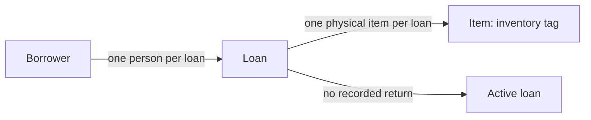

# Equipment lending

This context describes physical equipment and the loans recording who borrows it. The immediate decision is whether a physical item may have multiple active loans. The supplied snapshot contains that situation; the brief explicitly leaves its permissibility unresolved.

> **Freshness:** This page is `proposed` until reviewed by a human other than its author; it is not self-certified. Check staleness by re-running $kk:review-architecture against the Derived-from anchors at consumption time. Freshness is a review run, not a standing promise.

The diagram deliberately leaves simultaneous loans per item unsettled. It does not assert a uniqueness constraint or a separate stored borrower entity.

## Business rules

> **Provenance:** Definitions and the open policy question come from `requirements.md`. `records.json` establishes stored examples only. Any intent inferred from records or implementation is a presumption, `proposed` until ratified by a human with domain authority. No runtime implementation was supplied, so no enforcement claim can be made.

| # | Rule or decision | Status | Source and enforcement |
| --- | --- | --- | --- |
| L1 | An item is a physical piece of equipment identified by an inventory tag. | proposed | `requirements.md`; snapshot binding `records.json` → `items[].tag`. Enforcement unknown. |
| L2 | A loan records one person borrowing one item. | proposed | `requirements.md`; snapshot binding `records.json` → `loans[].borrower`, `loans[].item`. Enforcement unknown. |
| L3 | A loan without a recorded return is currently active. | proposed | `requirements.md`; both supplied loans have `returned_at: null`. Runtime interpretation of omitted or other values is unknown. |
| L4 | Whether one physical item may have more than one active loan remains unresolved. | undecided | Operations owner's question in `requirements.md`; see [P1](equipment-lending-traps.md#p1--stored-overlap-is-not-an-approved-policy) and RQ-1 below. No approved uniqueness rule or enforcement implementation supplied. |

## Terms

### Item

- **Definition:** One physical piece of equipment identified by an inventory tag.
- **Bindings:** `requirements.md`; `records.json` → `items[]`, `items[].tag`, `loans[].item`.
- **Status:** proposed
- **Aliases:** physical item, equipment item.
- **Not to be confused with:** A loan recording a borrowing relationship; the two loans in the snapshot refer to the same item.
- **Notes:** `CAM-7` is the supplied item. Its two active loan records do not decide allowed active-loan multiplicity.

### Borrower

- **Definition:** The person recorded as borrowing an item on a loan.
- **Bindings:** `requirements.md`; `records.json` → `loans[].borrower`.
- **Status:** proposed
- **Not to be confused with:** An item or a loan identifier.
- **Notes:** The snapshot names Mira and Ola. It does not establish a borrower identity model beyond those recorded values.

### Loan

- **Definition:** A record of one person borrowing one physical item.
- **Bindings:** `requirements.md`; `records.json` → `loans[]`, `loans[].id`, `loans[].item`, `loans[].borrower`.
- **Status:** proposed
- **Not to be confused with:** Proof of physical possession or proof that a borrowing is permitted.
- **Notes:** Loans `L1` and `L2` both reference `CAM-7`; their borrowers are Mira and Ola respectively.

### Active loan

- **Definition:** A loan without a recorded return, using the brief's definition of active.
- **Bindings:** `requirements.md`; `records.json` → `loans[].returned_at`.
- **Status:** proposed
- **Not to be confused with:** An approved or valid loan; activity and policy compliance are separate questions.
- **Notes:** Both supplied loans have `returned_at: null`, so both are active under the brief. No event history or runtime transition code is supplied.

## Decision queue

- **RQ-1 — Decider: operations owner.** May one physical item have more than one active loan at the same time? **Unblocks:** L4 and the checkout validation policy. Source: the owner's question in `requirements.md`.
- **RQ-2 — Decider: operations owner, conditional on prohibiting overlap.** Must the existing `CAM-7` overlap be resolved before checkout validation is introduced, or may it remain as a tracked exception? **Unblocks:** treatment of existing records; neither loan can be selected for correction from this snapshot alone.

No policy decision was ratified in this run. The next step is a conversation with the operations owner before checkout changes, not another layer of modelling.

---
**Derived-from:** `requirements.md` · `records.json`.
