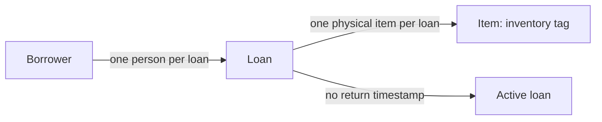

# Equipment lending

> **Freshness:** This page is `proposed` until reviewed by a human other than its author; it is not self-certified. Check staleness by re-running $kk:review-architecture against the Derived-from anchors at consumption time. Freshness is a verification run, not a standing promise.

This context describes people borrowing individually tagged physical equipment. The forcing question is whether a physical item may have multiple active loans before checkout validation is added. `requirements.md` explicitly leaves that policy unresolved. `records.json` contains two active loans for `CAM-7`; it supplies evidence of stored records, not permission or enforcement.

Read this page with [the traps page](equipment-lending-traps.md) under [the shared conventions](index.md).

The diagram describes each loan's associations and active classification. It deliberately leaves the permitted number of active loans per item undecided; it does not express an approved concurrency limit.

## Business rules

> **Provenance:** The declared meanings below come from `requirements.md`; the snapshot observations come from `records.json`. No separate ratification is supplied. Any intent inferred from records or code is a presumption, `proposed` until a domain authority ratifies it. Stored facts never establish what the business permits.

| # | Rule or decision | Status | Source and enforcement evidence |
| --- | --- | --- | --- |
| L1 | An item is a physical piece of equipment identified by an inventory tag. | proposed | Declared in `requirements.md`; represented by `records.json` `items[].tag`. No identifier validation or uniqueness enforcement is supplied. |
| L2 | A loan records one person borrowing one item. | proposed | Declared in `requirements.md`; represented by `records.json` `loans[].borrower` and `loans[].item`. No runtime enforcement is supplied. |
| L3 | A loan without a return timestamp is currently active. | proposed | Declared as “A loan without returned_at is currently active” in `requirements.md`; both supplied loans have `returned_at: null`. No runtime status calculation is supplied. |
| L4 | Whether one item may have multiple active loans remains a business decision. | undecided | Explicitly unresolved in `requirements.md`. The two `CAM-7` records do not settle permission; see traps `P1` and RQ-1. No checkout enforcement is supplied. |

## Glossary

### Item

- **Definition:** A physical piece of equipment identified by an inventory tag.
- **Bindings:** `requirements.md`; `records.json` `items[]`, `items[].tag`, and `loans[].item`. The supplied item is `CAM-7` (Camera).
- **Status:** proposed
- **Aliases:** physical item, equipment item
- **Not to be confused with:** A loan, which records borrowing of the item.
- **Notes:** The snapshot associates two active loan records with the same tag. Whether that multiplicity is allowed is RQ-1; tag uniqueness enforcement is not demonstrated.

### Loan

- **Definition:** A record of one person borrowing one item.
- **Bindings:** `requirements.md`; `records.json` `loans[]`, particularly records `L1` and `L2` and their `item`, `borrower`, and `returned_at` fields.
- **Status:** proposed
- **Not to be confused with:** The physical item or proof of its current physical custody.
- **Notes:** `L1` names Mira and `L2` names Ola; both reference `CAM-7`. No checkout write path, return process, or concurrency mechanism is supplied.

### Borrower

- **Definition:** The person whose borrowing is recorded by a loan.
- **Bindings:** `requirements.md` “one person”; `records.json` `loans[].borrower` (Mira and Ola).
- **Status:** proposed
- **Aliases:** person borrowing the item
- **Not to be confused with:** An independently verified current custodian. The snapshot does not establish who physically holds `CAM-7`.
- **Notes:** The supplied representation uses names. It provides no evidence of person-identity validation or a separate person registry.

### Active loan

- **Definition:** A loan with no recorded return timestamp, following the brief's current classification.
- **Bindings:** `requirements.md`; `records.json` `loans[].returned_at`, which is `null` for both `L1` and `L2`.
- **Status:** proposed
- **Not to be confused with:** An approved exclusive claim on an item or an independently confirmed physical possession.
- **Notes:** Both supplied loans qualify as active. The sources supply no checkout timestamps, historical ordering, expiry policy, or automated transitions from which a reader could determine which record should prevail.

## Decision queue

**RQ-1 — Decider: operations owner.** May one physical item have multiple active loans, or must checkout reject a second active loan? **Unblocks:** the permitted cardinality in L4 and the business rule for checkout validation. The requirements explicitly identify this as an unresolved decision.

**RQ-2 — Decider: operations owner.** If multiple active loans are forbidden, which supplied `CAM-7` loans, if any, should remain active after reconciliation: `L1`, `L2`, or neither? **Unblocks:** treatment of the existing snapshot before applying the chosen rule. This conditional question requires operational evidence; record order cannot answer it.

---

**Derived-from:** `requirements.md` · `records.json`
