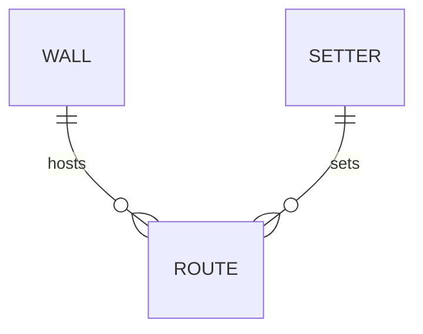

# Routesetting — domain glossary

> **Freshness:** This page is `proposed` until reviewed by a human other than its author — it is **not** self-certified. Check staleness by re-running `/kk:review-architecture` against the Derived-from anchors at consumption time.

Routesetting covers the lifecycle of climbing routes in the gym: setters put up routes on wall sections, grade them, open them to climbers, and eventually strip them.

*(Conceptual shape only: a route lives on one wall and is set by one setter.)*

## Business rules

> **Provenance:** Rules below are reverse-engineered from code unless a source is cited. Reverse-engineered rules are **presumptions of intent — `proposed` until ratified by a product owner.** Code confirms what the code does, never what the business meant.

| # | Rule | Status | Enforced at |
| --- | --- | --- | --- |
| L1 | A route must carry a grade before it opens to climbers. | proposed | see traps `D1` — declared, not enforced |
| L2 | A stripped route never reopens; re-setting the same line creates a new route. | proposed | `gym/route.go` `StripRoute` |
| L3 | Stripped routes are retained for 30 days, then purged. | proposed | `gym/archive.go` `purgeExpired` |

## Terms

### Route

- **Definition:** A climbable line on a wall section, from first hold to top-out, set as one unit and climbed as one unit.
- **Bindings:** `gym/` · `Route` · `Route.Difficulty` · `gym/route.go`
- **Status:** proposed
- **Aliases:** line, climb
- **Not to be confused with:** Wall (the surface a route lives on; one wall hosts many routes).
- **Notes:** Lifecycle states live in `RouteState` (`gym/route.go`).

### Wall

- **Definition:** A physical climbing surface, divided into named sections that routes are assigned to.
- **Bindings:** `gym/wall.go` · `Wall` · `Wall.Sections`
- **Status:** proposed
- **Aliases:** —
- **Not to be confused with:** Route (a wall persists; routes on it turn over).
- **Notes:** —

### Grade

- **Definition:** The difficulty rating the setting team agrees for a route before it opens; the rating climbers see on the route card.
- **Bindings:** `Route.Difficulty` (`gym/route.go`) · `gym/grading.go` `Scale`
- **Status:** proposed
- **Aliases:** difficulty, rating
- **Not to be confused with:** a setter's private working grade during a set (never displayed).
- **Notes:** Free-text at the write path — see traps `P1`.

### Setter

- **Definition:** The staff member who puts up a route and owns its grade proposal.
- **Bindings:** `Route.SetBy` (`gym/route.go`)
- **Status:** proposed
- **Aliases:** routesetter
- **Not to be confused with:** —
- **Notes:** —

---
**Derived-from:** `gym/route.go` · `gym/wall.go` · `gym/grading.go` · `gym/archive.go`
