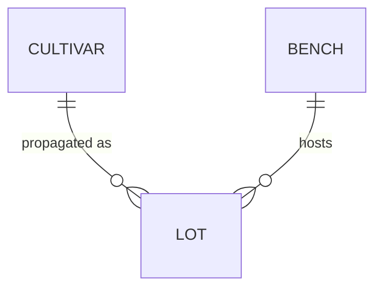

# Nursery propagation — domain glossary

> **Freshness:** This page is `proposed` until reviewed by a human other than its author — it is **not** self-certified. Check staleness by re-running `/kk:review-architecture` against the Derived-from anchors at consumption time; freshness is a skill run, not a standing promise.

The nursery propagation context covers the plant varieties the nursery grows (cultivars), the batches they move through the greenhouse in (lots), and the growing surfaces those batches occupy (benches). Divergences and cross-file hazards live in [nursery-traps.md](nursery-traps.md).

*(Load-bearing shape only — a lot is a batch of one cultivar; a lot sits on one bench at a time.)*

## Business rules

> **Provenance:** Rules below are reverse-engineered from code unless a source is cited. Reverse-engineered rules are **presumptions of intent — `proposed` until ratified by the head grower.** Code confirms what the code does, never what the business meant.

| # | Rule | Status | Enforced at |
| --- | --- | --- | --- |
| L1 | A lot occupies exactly one bench at a time. | proposed | `lots/placement.go` `PlaceLot` |
| L2 | A bench cannot exceed its lot capacity. | proposed | `benches/capacity.go` `CanAccept` |

## Terms

### Cultivar

- **Definition:** A named plant variety the nursery propagates and sells.
- **Bindings:** `cultivars/` · `cultivars/catalog.go` · `Cultivar.Species`
- **Status:** proposed
- **Aliases:** variety (sales floor)
- **Not to be confused with:** Lot (the cultivar is the what; the lot is a batch of it).

### Lot

- **Definition:** A batch of plants of one cultivar moving through the nursery together.
- **Bindings:** `lots/placement.go` · `Lot` · `Lot.CultivarID`
- **Status:** proposed
- **Not to be confused with:** Bench (the lot is the batch; the bench is where it sits).

### Bench

- **Definition:** A growing surface with a fixed capacity in lots.
- **Bindings:** `benches/` · `benches/capacity.go` · `Bench.Capacity`
- **Status:** proposed
- **Notes:** Capacity is gated at the caller — see traps `P1`.

### Hardening Run

- **Definition:** The staged move of a lot from greenhouse to outdoor conditions before sale; will be tracked once the hardening feature ships.
- **Bindings:** none yet — planned as a `HardeningRecord` struct under `lots/`.
- **Status:** proposed

---
**Derived-from:** `cultivars/catalog.go` · `lots/placement.go` · `benches/capacity.go` · `cultivars/` · `lots/` · `benches/`
