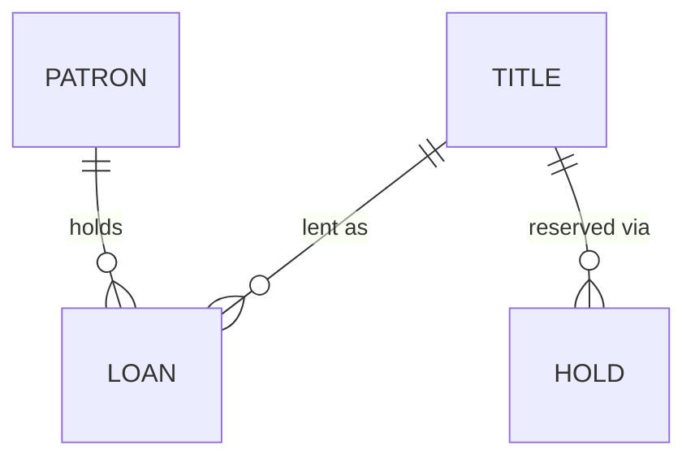

# `$kk:model` — kit output contract

The **domain-reference kit** is the only durable artifact `$kk:model` produces. This file is the authoritative format for it (design §3). The drafting phase (process phase 4) writes to this contract; the conventions-bind-author self-check (phase 6) grades the produced pages against it.

The contract is deliberately small: **two durable pages per bounded context, plus one conventions index per home.** Everything else a modelling run might be tempted to emit — scoped diagrams, delta models, ERDs, logical/physical model pages — is disposable and is *not* produced (see §Kit-scope pushback).

The example fragments below use a **library-lending** domain purely to show shape. They are illustrations, not a template to clone — a real kit's terms come from the archaeology, never from this file.

---

## The two pages

Per bounded context, produce exactly two pages that live side by side in the home:

| Page | File | Carries | Audience |
| --- | --- | --- | --- |
| Glossary | `<context>.md` | the concepts, their bindings to code, and the business rules | product (definitions) + engineering (bindings) |
| Divergences & traps | `<context>-traps.md` | only facts **no single file reveals** — code-vs-rule divergences and cross-file hazards | engineering |

The two are one composite artifact: the glossary's rules table points at the traps page's `D#`/`P#` entries, so the pages are authored, reviewed, and re-verified together. `$kk:review-architecture` accepts either page's path and auto-discovers the sibling.

---

## Glossary page — `<context>.md`

### 1. Summary + one conceptual-altitude diagram

A short prose summary of the context, then **exactly one** diagram at **conceptual altitude**: entities, the relationships between them, and only the **load-bearing** attributes — the shape of the domain, not a field dump. Text-based (Mermaid or equivalent) so it diffs and re-verifies.

One diagram, not many. A field-level ERD is a schema mirror (see §Kit-scope pushback) and is wrong by default — the code is the schema reference.



*(Load-bearing shape only — a `Loan` belongs to one `Patron` and one `Title`; a `Hold` queues against a `Title`. No `created_at`, no surrogate keys, no field dump.)*

### 2. Business rules — numbered table with provenance banner

Fold the domain's rules into a compact numbered table (`L1…Ln`). Head it with a **provenance banner** stating that any rule reverse-engineered from code is a **presumption of intent, `proposed` until a human ratifies it** (F3 — code establishes code-clock facts only; intent derived from code is a presumption). Each rule's *enforcement pointer* (where the rule lives in code) is a binding the reviewer can check; the rule's *intent-truth* is exactly what stays `proposed`.

> **Provenance:** Rules below are reverse-engineered from code unless a source is cited. Reverse-engineered rules are **presumptions of intent — `proposed` until ratified by a product owner.** Code confirms what the code does, never what the business meant.

| # | Rule | Status | Enforced at |
| --- | --- | --- | --- |
| L1 | A patron may hold at most 5 concurrent loans. | proposed | `loans/policy.go` `maxConcurrent` |
| L2 | A title with an active hold queue cannot be renewed. | proposed | see traps `D2` — declared, not enforced |

### 3. Per-term entries — dual-audience fields

One entry per concept. Every entry carries these fields (omit a field only when genuinely empty):

- **Definition** — for product; the **business clock**. What the concept *means* to the business.
- **Bindings** — for engineering; the **code clock**. Where the concept lives: directory, collection/constant, field, symbol. **Cite file or symbol — never line numbers** (lines rot before they are read).
- **Status** — one marker (see below).
- **Aliases** — other names the same concept goes by.
- **Not to be confused with** — the near-neighbor concept it is routinely conflated with.
- **Notes** — anything else load-bearing. A note citing a ticket **must state what retires it** (see ticket-note discipline).

```markdown
### Hold

- **Definition:** A patron's reservation of a title that is currently on loan; grants borrowing priority when the title returns.
- **Bindings:** `holds/` · collection `holds` · `Hold.QueuePosition` · `holds/queue.go`
- **Status:** canonical
- **Aliases:** reservation (UI), queue entry (legacy code)
- **Not to be confused with:** Loan (a Hold has no due date and confers no possession).
- **Notes:** Priority tie-break is undecided — see decision queue RQ-3.
```

*(This entry is shown as `canonical` only because the library domain it illustrates has been through ratification. A first greenfield run has no ratification, so every reverse-engineered term defaults to `proposed` — see §4. Do not copy the `canonical` marker from this format illustration.)*

### 4. Status markers

Exactly one per term:

| Marker | Meaning |
| --- | --- |
| `canonical` | Ratified by a human with authority over the domain. |
| `proposed` | Author's best reading; awaiting ratification. **Default for anything reverse-engineered from code.** |
| `undecided` | The domain itself has not settled this; belongs in the decision queue. |
| `deprecated-alias` | A name kept for recognition; points at the canonical term. |
| `overloaded` | One name carrying two meanings; the entry disambiguates them. |

`$kk:model` **never flips `proposed → canonical` on its own** — that requires a recorded human decision (out of scope until `decide`, M2.1). In brownfield mode, existing markers are never changed unilaterally.

### 5. Derived-from footer

End the page with a **Derived-from footer** listing **every path read to build it** — no line numbers, files and symbols only. This is what makes each binding re-checkable at its source and what `$kk:review-architecture` re-verifies for freshness.

```markdown
---
**Derived-from:** `loans/policy.go` · `holds/queue.go` · `titles/catalog.go` · `holds/` · ticket LIB-214
```

### Ticket-note retirement discipline

Any note that cites a ticket (`"pending LIB-214"`) **states the condition that retires the note** — what ships, what decision lands, what makes the note obsolete. A durable page accumulating live ticket references rots as those tickets ship: the note lingers, asserting a condition that is no longer true. If you cannot state what retires it, it is not a durable note — it belongs in the decision queue.

### Term-count guideline

**Typically 10–20 terms for a first greenfield slice — a guideline, not a requirement.** The real count is set by the **forcing question** (model only what the decision needs), the **mode** (a brownfield delta may touch two terms), and **feature scope**. A run that emits 40 terms for a three-term decision has boiled the ocean; a run that emits three for a domain the decision spans has under-modelled. Let the decision, not the number, set the count.

---

## Divergences & traps page — `<context>-traps.md`

Records **only facts no single file reveals** — the value a reader cannot get by opening one file:

- **`D#` — divergences.** Where the code diverges from a stated rule (a declared rule that nothing enforces; an enforced behavior no rule describes).
- **`P#` — cross-file hazards.** Traps that only appear when two or more files are read together (a single-result lookup over data written without a uniqueness guarantee; a silent default in one module that another module relies on).

Rules:

- **Stable numbering.** `D#`/`P#` numbers are permanent; a retired entry's number is **never reused** (so cross-references from the glossary rules table stay valid).
- **Never a schema mirror.** The code is the schema reference. A page that restates field lists or table structures is wrong by default — it drifts the moment the schema changes and adds no fact the code doesn't already carry.
- **Self-limiting staleness.** Each entry describes a divergence that *should be fixed*. When the divergence is fixed, **delete the entry in that same PR.** An entry outlives its divergence only if someone forgets — so the entry names the fix that kills it.

```markdown
### D2 — Renewal-during-hold rule declared but unenforced

Rule L2 says a title with an active hold queue cannot be renewed. `loans/renew.go`
checks due dates and loan caps but never consults `holds`. The rule is intent; the
code does not implement it.

**Retires when:** `renew.go` gains a hold-queue check, or L2 is withdrawn.
```

---

## Conventions index — once per home (`index.md`)

Written **once per home, not per context.** The **home** is the durable-docs root the kit pages live in (e.g. `docs/architecture/`, or a knowledge repo's domain-reference directory); every `<context>.md` / `<context>-traps.md` pair in that home reads under one shared contract. The index declares, so no kit page has to restate them:

- the per-term entry fields (Definition / Bindings / Status / Aliases / Not to be confused with / Notes);
- the status markers and their meanings;
- the **two-clock rule** — Definitions track the business clock; Bindings track the code clock; a code fact never ratifies a business intent;
- the citation rules — file or symbol, **never line numbers**;
- the freshness model (below).

If the home already has an `index.md`, do not rewrite it — the current context's pages conform to the existing index. Only a new home gets a new index.

---

## Freshness banner

Every produced page (glossary and traps) carries a banner stating both facts:

> **Freshness:** This page is `proposed` until reviewed by a human other than its author — it is **not** self-certified (F7). Check staleness by re-running `$kk:review-architecture` against the Derived-from anchors at consumption time; freshness is a skill run, not a standing promise.

The two halves matter independently: (a) **no self-certification** — the author marking their own page "verified/trusted" is exactly the failure this guards against; (b) the freshness mechanism is a **re-verification run**, not a maintenance social contract (cross-repo reviewer obligations were field-falsified — near-zero adoption).

---

## Homes-resolution precedence

The skill is **home-agnostic** and resolves where to write in this order:

1. **Brownfield** — wherever the existing kit already lives. Never relocate it.
2. **A user-declared home** — covers cross-repo domains kept in a dedicated knowledge repo. Use it as given.
3. **Default** — propose `docs/architecture/` as the single-repo default home (kit pages as `<context>.md` / `<context>-traps.md` directly in it) **and confirm with the user before writing.**

The org picks the home; the skill asks, never assumes.

---

## Kit-scope pushback — everything else is disposable

The kit is the *only* durable artifact. Scoped diagrams, delta models, ERDs, and standing logical/physical model pages are **drawn per-feature inside design docs and thrown away** — they are not kit pages.

When asked to produce one as a durable artifact, **push back before complying**: name the maintenance cost (a standing physical/ERD page is a copy of the schema that is wrong by default and drifts every migration), and offer the durable alternative (the conceptual-altitude glossary diagram) or a disposable per-feature diagram inside the relevant design doc. Comply only after the user has heard the cost — do not silently emit a durable schema mirror.

---

## Conventions-bind-author self-check (phase 6)

Before surfacing, grade the produced pages against this contract — the author obeys the kit's own conventions (F6):

- [ ] Every intent claim reverse-engineered from code is `proposed`, not `canonical`.
- [ ] No line numbers anywhere — citations are file or symbol only.
- [ ] Derived-from footer present and lists **every** path read.
- [ ] **Exactly one** diagram on the glossary page, at conceptual altitude.
- [ ] Traps page contains **no schema mirror**; every entry names what retires it.
- [ ] Every ticket-citing note states its retirement condition.
- [ ] Provenance banner present on the rules table; freshness banner on both pages.
- [ ] Status markers present and justified; no unilateral `proposed → canonical` flip.
