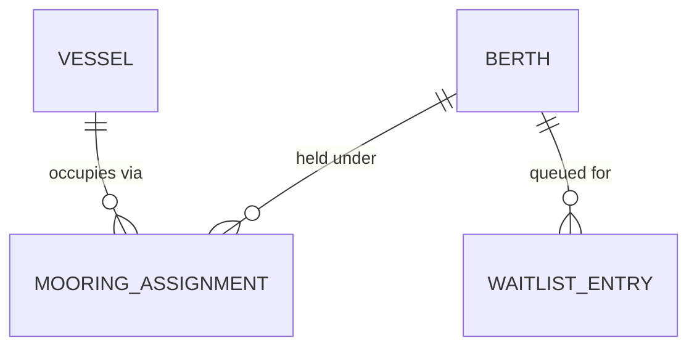

# Marina berthing — domain glossary

> **Freshness:** This page is `proposed` until reviewed by a human other than its author — it is **not** self-certified. Check staleness by re-running `$kk:review-architecture` against the Derived-from anchors at consumption time; freshness is a skill run, not a standing promise.

The marina berthing context covers the rentable mooring spaces (berths), the vessels that occupy them, and the assignment records that tie the two together. Divergences and cross-file hazards live in [marina-traps.md](marina-traps.md).

*(Load-bearing shape only — an assignment ties one vessel to one berth; a waitlist entry queues a vessel against an occupied berth.)*

## Business rules

> **Provenance:** Rules below are reverse-engineered from code unless a source is cited. Reverse-engineered rules are **presumptions of intent — `proposed` until ratified by the harbor office.** Code confirms what the code does, never what the business meant.

| # | Rule | Status | Enforced at |
| --- | --- | --- | --- |
| L1 | A vessel may carry at most one active mooring assignment. | proposed | `moorings/assign.go` `hasActiveAssignment` |
| L2 | A berth flagged for maintenance cannot be assigned. | proposed | see traps `D1` — declared, not enforced |
| L3 | Transient vessels are limited to 14 consecutive nights. | canonical — settled harbor policy | not enforced in code |

*(L3's 14-night figure is an invented placeholder — no harbor-office input exists yet; a real rate-card or dockmaster decision would replace it.)*

## Terms

### Berth

- **Definition:** A rentable mooring space on a pier, identified by name.
- **Bindings:** `berths/` · `berths/registry.go` · `Berth.Pier`
- **Status:** proposed
- **Aliases:** slip (dockhand slang)
- **Not to be confused with:** Mooring Assignment (the berth is the space; the assignment is its occupancy).
- **Notes:** Berth names are assumed unique by lookups — see traps `P1`.

### Mooring Assignment

- **Definition:** The record of a vessel occupying a berth, from a start time until released.
- **Bindings:** `moorings/assign.go` · `Assignment` · `Assignment.Ended`
- **Status:** proposed
- **Aliases:** mooring (front-desk shorthand)
- **Not to be confused with:** Waitlist Entry (a queued request confers no occupancy).

### Vessel

- **Definition:** A boat known to the marina; the party a berth is assigned to.
- **Bindings:** field `Assignment.VesselID` in `moorings/assign.go` — vessels have no standing record of their own.
- **Status:** proposed

### Dockage Rate

- **Definition:** The nightly fee schedule for a berth, stepped by vessel length.
- **Bindings:** `berths/registry.go` · symbol `RateSchedule`
- **Status:** proposed

### Waitlist Entry

- **Definition:** A vessel's queued request for a berth that is currently occupied.
- **Bindings:** `berths/waitlist.go` · `WaitlistEntry`
- **Status:** proposed

### Haul-Out

- **Definition:** The scheduled lift of a vessel out of the water for hull work; will be introduced with next season's dry-storage offering.
- **Bindings:** none yet
- **Status:** proposed
- **Notes:** Binds once the dry-storage feature lands.

### Transient Stay

- **Definition:** A short visiting stay by a vessel without an annual contract.
- **Bindings:** will be represented in code
- **Status:** proposed

---
**Derived-from:** `berths/registry.go` · `moorings/assign.go` · `berths/` · `moorings/`
